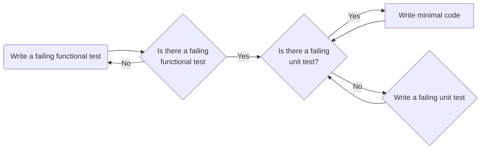

# TDD Flow

```mermaid
flowchart LR;
    B(Write a failing functional test) --> C{Is there a failing 
                    functional test};
    C -->|No| B;
    C -->|Yes| D{Is there a failing 
                    unit test?};
    D -->|Yes| E[Write minimal code];
    E --> D;
    D -->|No| F{Write a failing unit test};
    F --> D;
```